# The Final 32 x 32 GUI Documentation

This documentation is regarding the **32 x 32** GUI and its features. This GUI is made to control polarised motors to display pixelised images. There are different shades of grey to allow the user to draw on it too along with preset patterns for the user to use. The different shades of grey has different values that will process when the "Send Image" button is pressed.

# Completed GUI
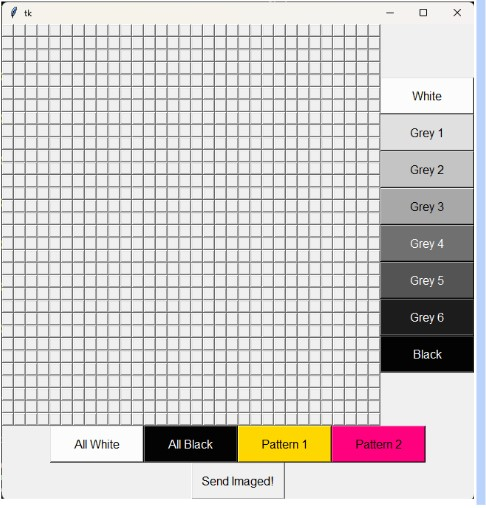

# Hardware Used
**Model of hardware** : RaspberryPi 4 Model B <br>
**Version** : Raspbian Buster <br>
 <br>
*Photo of Raspberry Pi*

# Software Setup & Installation 
## Setting up of the Raspberry PI

### PuTTy
After installing PuTTy, Change your desired **hostname** and **Connection Type** to "**SSH**"
Input a name under **Saved Sessions** and click on save, the file would appear at the left hand side of the Settings. Click the file once and load it. To finish it off Click **Open**.

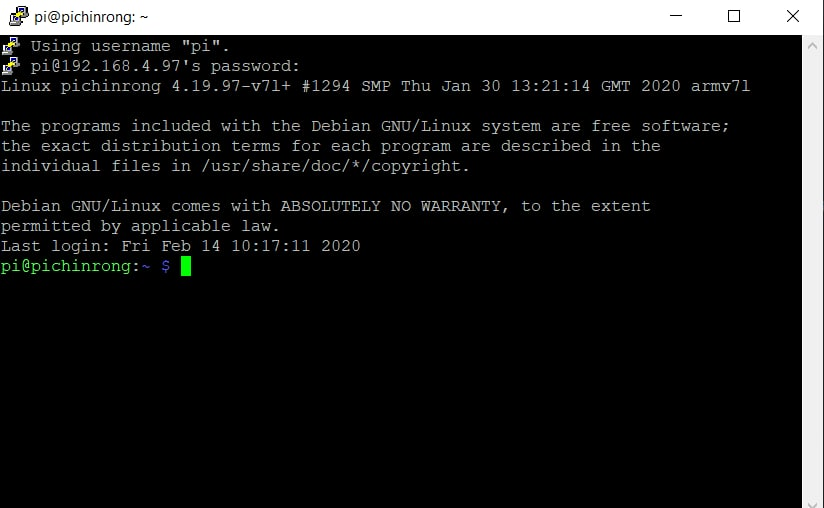 <br>
*Photo of PuTTy Setup*

Enter your username and password. The default login for User is "pi" and the Password is "raspberry".

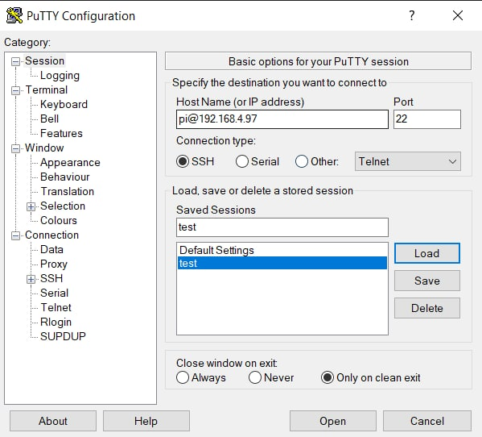 <br>
*Photo of PuTTy CMD*

To change your password, use the following command
``` 
sudo passwd
```

## 1. Updating of Raspberry Pi
```
sudo apt update <br>
sudo apt upgrade
```

## 2. Configuring of Raspberry Pi
SSH is a network communication protocol that enables two computers to communicate and share data.
To **enable** SSH, type the following
```
sudo raspi-config
```

Select `3 Interface Options` <br>
Select `P2 SSH` <br>
**Enable SSH**

### Enabling Virtual Network Computing (VNC)
**VNC** is a cross-platform screen sharing system that can be used to remotely control another computer. 
<br>

To **enable** VNC, type the following
```
sudo raspi-config
```
Select `3 Interface Options` <br>
Select `P3 VNC` <br>
Select  **Enable VNC**

# Setting Up The GUI
To create a tkinter GUI, we need to import the tkinter library. 
```
from tkinter import *
```
Create a window
```
main = Tk()
```

For the window to stay on the screen, we need to loop it. 
```
main.mainloop()
```

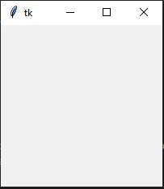 <br>
*Photo of Main Window*

# Frame Function
Under the **Main Window** there are many buttons, frames are made to make the buttons organised. This will help with the buttons being in their own group.

**Frame1** is for the 32x32 grid.
```
frame1 = Frame(main) #32x32 btn
frame1.grid(row=0, column=0)
```
**Frame2** is for the shades buttons. 
```
frame2 = Frame(main) #shades btn
frame2.grid(row=0, column=1)
```
**Frame 3** is for the features buttons. 
```
frame3 = Frame(main) #Shade btn
frame3.grid(row=1, columnspan=2) 
```
**Frame4** is for the send button. 
```
frame4 = Frame(main) #Send btn
frame4.grid(row=2, columnspan=2)
```

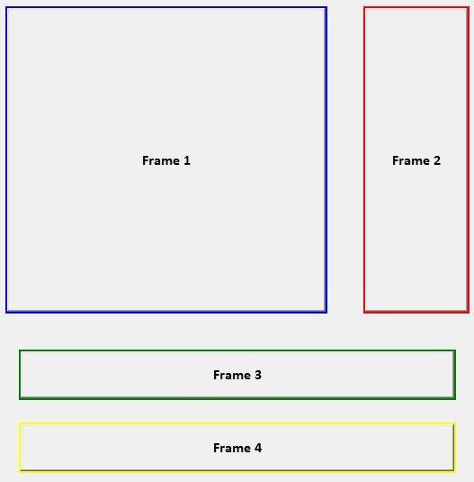 <br>
*Photo of Frames in Window*

# Create 32 x 32 Buttons
The 32 x 32 buttons are made by **nested for loop** that is inside
the list 'button'
```
button = [[j for j in range(32)] for i in range(32)]
for j in range (32):
  for i in range (32):
    button[i][j] = Button(frame1, font=("Arial, 4"), width=2, height=2, command=lambda r=i, c=j:whitebtn(r, c))
    button[i][j].grid(row=i, column=j)
```

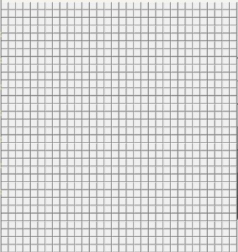 <br>
*Photo of 32 x 32 Grid*

# Create Shades Buttons
These buttons will change the background color and the text font for the buttons when the following shade is selected
```
white = Button(frame2, text="White", font=("Arial, 12"), bg='grey99', width=13, height=2, command=lambda m=0:change_colour(m))
white.grid(row=0, column=0)

grey1 = Button(frame2, text="Grey 1", font=("Arial, 12"), bg='grey88', width=13, height=2, command=lambda m=1:change_colour(m))
grey1.grid(row=1, column=0)

grey2 = Button(frame2, text="Grey 2", font=("Arial, 12"), bg='grey77', width=13, height=2, command=lambda m=2:change_colour(m))
grey2.grid(row=2, column=0)

grey3 = Button(frame2, text="Grey 3", font=("Arial, 12"), bg='grey66', width=13, height=2, command=lambda m=3:change_colour(m))
grey3.grid(row=3, column=0)

grey4 = Button(frame2, text="Grey 4", font=("Arial, 12"), bg='grey44', fg='white', width=13, height=2, command=lambda m=4:change_colour(m))
grey4.grid(row=4, column=0)

grey5 = Button(frame2, text="Grey 5", font=("Arial, 12"), bg='grey33', fg='white', width=13, height=2, command=lambda m=5:change_colour(m))
grey5.grid(row=5, column=0)

grey6 = Button(frame2, text="Grey 6", font=("Arial, 12"), bg='grey11', fg='white', width=13, height=2, command=lambda m=6:change_colour(m))
grey6.grid(row=6, column=0)

black = Button(frame2, text="Black", font=("Arial, 12"), bg='grey1', fg='white', width=13, height=2, command=lambda m=7:change_colour(m))
black.grid(row=7, column=0)
```
_
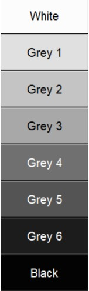 <br>
*Photo of Shade Buttons*


## Creating a variable to store colour value. 
```
colour = 0
```
**Lambda** will be used for the shade button for the 32 x 32 GUI. **Lambda** is used when we require a nameless function for a short period of time. 
```
def change_colour(m): 
  global colour
  colour=m
  if colour == 0:
    print("Choose Button to change color to White!")
  elif colour == 1:
    print("Choose Button to change color to Grey 1!")
  elif colour == 2:
    print("Choose Button to change color to Grey 2!")
  elif colour == 3:
    print("Choose Button to change color to Grey 3!")
  elif colour == 4:
    print("Choose Button to change color to Grey 4!")
  elif colour == 5:
    print("Choose Button to change color to Grey 5!")
  elif colour == 6:
    print("Choose Button to change color to Grey 6!")
  else :
    print("Choose Button to change color to Black!")
```
## **Output**

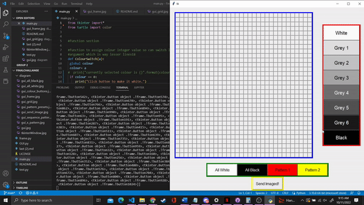 <br>
*GIF Of Shade Change command*

Using if else statement to create function for the white buttons. 
```
def whitebtn(i, j):
  global colour   
  if colour == 0:
    button[i][j].config(bg='grey99')
    value[i][j] = 0
  elif colour == 1: 
    button[i][j].config(bg='grey88')
    value[i][j] = 20
  elif colour == 2:
    button[i][j].config(bg='grey77')
    value[i][j] = 30
  elif colour == 3: 
    button[i][j].config(bg='grey66')
    value[i][j] = 40
  elif colour == 4:
    button[i][j].config(bg='grey44')
    value[i][j] = 50  
  elif colour == 5: 
    button[i][j].config(bg='grey33')
    value[i][j] = 60
  elif colour == 6:
    button[i][j].config(bg='grey11')
    value[i][j] = 70
  else: 
    button[i][j].config(bg='grey1')
    value[i][j] = 90
```
## **Output**
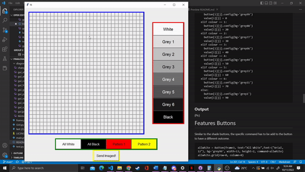 <br>
*Photo of Shade color change*

# Features Buttons 
Similar to the shade buttons, the specific command has to be add to the button to have a different outcome.
```
allwhite = Button(frame3, text="All White",font=("Arial, 12"), bg='grey99', width=13, height=2, command=allwhite)
allwhite.grid(row=0, column=0)

allblack = Button(frame3, text="All Black",font=("Arial, 12"), bg='grey1', fg='white', width=13, height=2, command=allblack)
allblack.grid(row=0, column=1)

pattern1 = Button(frame3, text="Pattern 1",font=("Arial, 12"), bg='gold', width=13, height=2, command=pat1)
pattern1.grid(row=0, column=2)

pattern2 = Button(frame3, text="Pattern 2",font=("Arial, 12"), bg='#ff007f', width=13, height=2, command=pat2)
pattern2.grid(row=0, column=3)
```
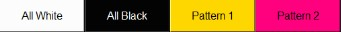 <br>
*Photo of Feature Buttons*

## Code for the the features function
Code for **All WHITE** Function. 
```
def allwhite():
  print("All White!")
  for j in range (32):
    for i in range (32):
      button[i][j].config(bg='grey99')
      value[i][j] = 0
```
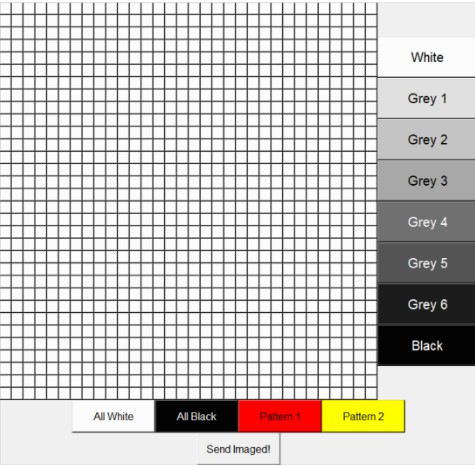 <br>
*Photo of ALL WHITE Feature*

Code for **All BLACK** Function. 
```
print("All Black!")
  for j in range (32):
    for i in range (32):
      button[i][j].config(bg='grey1')
      value[i][j] = 90
```
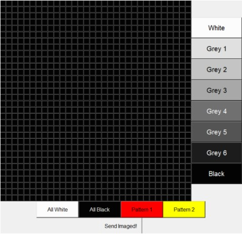 <br>
*Photo of ALL BLACK Feature*

Code for **PATTERN 1** Function.  
```
def pat1():
  print("Pattern 1!")
  for j in range (32): 
    for i in range(32): 
      if j <= 5: 
        button[i][j].config(bg='grey99') 
        value[i][j] = 0 
      elif 6 <= j <= 10: 
        button[i][j].config(bg='grey77') 
        value[i][j] = 30 
      elif 11 <= j <= 15: 
        button[i][j].config(bg='grey44') 
        value[i][j] = 50 
      elif 16 <= j <= 20: 
        button[i][j].config(bg='grey33') 
        value[i][j] = 60 
      elif 21 <= j <= 25: 
        button[i][j].config(bg='grey11') 
        value[i][j] = 70 
      else: 
        button[i][j].config(bg='grey1') 
        value[i][j] = 90 
```
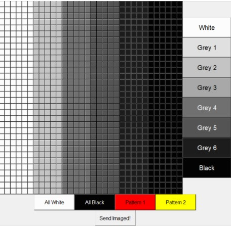 <br>
*Photo of PATTERN 1 Feature*

Code for **PATTERN 2** Function. 
```
def pat2():
  print("Pattern 2!")
  for i in range (32): 
     for j in range (32): 
      button[i][j].config(bg ='white') 
      value[i][j] = 0 
      if i == j:  
        button[i][j].config(bg='grey1') 
        value[i][j] = 90 
      elif i + j == 1:  
        button[i][j].config(bg='grey99') 
        value[i][j] = 0 
      elif i + j == 31:  
        button[i][j].config(bg='grey1') 
        value[i][j] = 90 
```
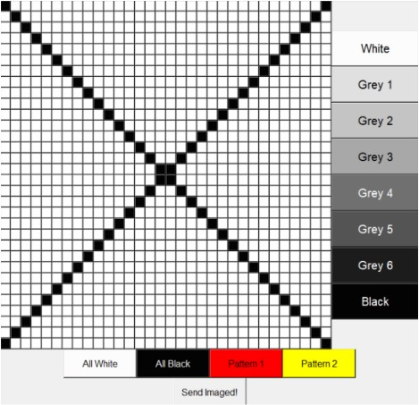 <br>
*Photo of PATTERN 2 Feature*

# Send Button 
There are different values for each shade of grey, 
```
send = Button(frame4, text="Send Imaged!", font=("Arial, 12"), width=13, height=2, command=sendimg)
send.grid(row=0, column=0)
```
 <br>
*Photo of Send Value Button*

## Assign function to the send button. 
First, create a variable to store the value. 
```
value = [[0 for j in range(32)] for i in range (32)]
```

Function code for send button. 
```
def sendimg():
  global value
  print("Image Print! Values are...")
  print(value)
```

 
